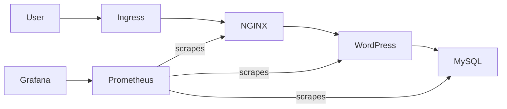

# HelmFlow — Production-Ready WordPress on Kubernetes

**Helm • Kubernetes • Custom Docker Images • Nginx (OpenResty) • MySQL • Ingress • HPA • Prometheus • Grafana**

---

## Overview

**HelmFlow** is a production-style WordPress platform deployed on Kubernetes using **Helm**, designed to mirror how real-world DevOps and Platform teams build, scale, and observe applications.

This project goes beyond basic deployment and focuses on:
- Helm chart design and reusability
- Environment-specific configuration (dev / prod)
- Horizontal Pod Autoscaling (CPU + Memory)
- Secure ingress-based traffic routing
- Persistent storage for stateful workloads
- Real-world observability with Prometheus & Grafana

This is **not a toy project** — it demonstrates production-aligned Kubernetes patterns.

---

## Key Objectives

- Build reusable Helm charts for a multi-service application
- Separate ingress and application concerns
- Support multiple environments using Helm values
- Use custom Docker images instead of community charts
- Implement CPU & memory based autoscaling (HPA)
- Add production-grade monitoring and dashboards

---

## Architecture



---

## Features

- WordPress (PHP-FPM) deployed as a stateless service
- MySQL backend with persistent storage (PVC)
- OpenResty (NGINX + Lua) reverse proxy
- Helm-based deployment with reusable templates
- Environment-specific values (`dev` / `prod`)
- Horizontal Pod Autoscaler (CPU + Memory)
- Secure Ingress with TLS
- Prometheus metrics collection
- Grafana dashboards for health, HPA, CPU & memory
- Clean namespace separation (app / monitoring)

---

## Repository Structure

```
.
├── charts
│   ├── monitoring-ingress
│   │   ├── Chart.yaml
│   │   ├── templates
│   │   │   └── ingress.yaml
│   │   └── values.yaml
│   └── wordpress
│       ├── Chart.yaml
│       ├── templates
│       │   ├── _helpers.tpl
│       │   ├── deployment-mysql.yaml
│       │   ├── deployment-nginx.yaml
│       │   ├── deployment-wordpress.yaml
│       │   ├── hpa-wordpress.yaml
│       │   ├── ingress.yaml
│       │   ├── pvc-mysql.yaml
│       │   ├── pvc-wordpress.yaml
│       │   ├── service-mysql.yaml
│       │   ├── service-nginx.yaml
│       │   └── service-wordpress.yaml
│       ├── values.yaml
│       ├── values-dev.yaml
│       └── values-prod.yaml
├── docker
│   ├── mysql
│   │   ├── Dockerfile
│   │   └── my.cnf
│   ├── nginx-openresty
│   │   ├── Dockerfile
│   │   └── nginx.conf
│   └── wordpress
│       └── Dockerfile
├── wordpress.crt
├── wordpress.key
└── README.md
```

---

## Prerequisites

- Kubernetes cluster (Docker Desktop / Minikube / Kind)
- Helm 3.x
- kubectl
- Docker & Docker Hub account
- Git

---

## Build & Push Docker Images

```bash
docker build -t <dockerhub-user>/wordpress:latest ./docker/wordpress
docker build -t <dockerhub-user>/mysql:latest ./docker/mysql
docker build -t <dockerhub-user>/nginx-openresty:latest ./docker/nginx-openresty

docker push <dockerhub-user>/wordpress:latest
docker push <dockerhub-user>/mysql:latest
docker push <dockerhub-user>/nginx-openresty:latest
```

---

## Deploy Application with Helm

### Development

```bash
helm install blog-dev charts/wordpress -f charts/wordpress/values-dev.yaml
```

### Production

```bash
helm install blog-prod charts/wordpress -f charts/wordpress/values-prod.yaml
```

Verify:

```bash
kubectl get pods
kubectl get svc
kubectl get pvc
kubectl get hpa
```

---

## Ingress & Access

Add host entry:

```bash
127.0.0.1 wordpress.localhost
```

Access:

```
https://wordpress.localhost
```

---

## Monitoring Setup

### Install kube-prometheus-stack

```bash
helm repo add prometheus-community https://prometheus-community.github.io/helm-charts
helm repo update

helm install monitoring prometheus-community/kube-prometheus-stack   -n monitoring --create-namespace
```

---

## Grafana Access

```bash
kubectl get secret monitoring-grafana -n monitoring \
  -o jsonpath="{.data.admin-password}" | base64 --decode

kubectl port-forward svc/monitoring-grafana 3000:80 -n monitoring
```

Open:  
http://localhost:3000  
Login: `admin / <password>`

---

## Grafana Dashboards

The project includes a **production-style Grafana dashboard** showing:

- Running WordPress pods
- HPA current / desired replicas
- CPU utilization (% of request)
- Memory utilization (% of request)
- CPU usage per pod
- Node-level context

Dashboards are designed to **explain autoscaling behavior visually**.

---

## Horizontal Pod Autoscaling (HPA)

- Target: WordPress deployment
- Metrics:
  - CPU utilization
  - Memory utilization
- Environment-specific scaling limits
- Stateless-only autoscaling (MySQL excluded by design)

---

## Design Decisions

- Separate ingress and application charts
- Autoscale only stateless workloads
- Use values files instead of duplicating YAML
- Avoid fake or unavailable metrics
- Prefer pod-level aggregation for stability

---

## Cleanup

```bash
helm uninstall blog-dev
helm uninstall blog-prod
helm uninstall monitoring -n monitoring
kubectl delete ns monitoring
```

---

## Maintainer

**Vivek Shaurya**  
GitHub: **mrperfect0603**

---

Love 💙 & Peace ☮️
